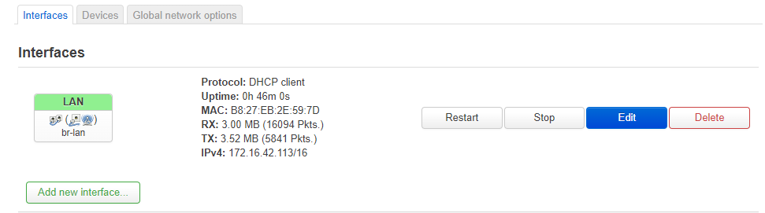
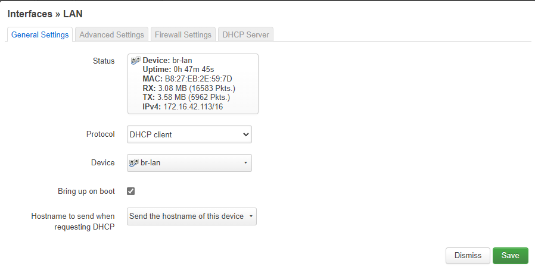
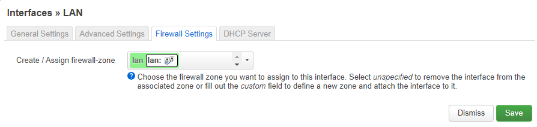

# Configure Pi running the wireless AP (Access Point) mode.
## 1  Flash image on your Pi device
### 1.1 Download images from [OpenWrt official Pi project](https://openwrt.org/toh/raspberry_pi_foundation/raspberry_pi)  
### 1.2 Follow the instructions to flash images. Please note that Pi3 B+ needs additional preparation. Otherwise, the wireless may not work properly. [Click here](https://openwrt.org/toh/raspberry_pi_foundation/raspberry_pi#wireless_country_code_issue)  

## 2  First time login OpenWrt web GUI - LuCI
## 2.1 If it is your first time to connect the Pi, the Ethernet port is running as the LAN port and providing DHCP service by default. 
Use a network cable connect your pc to the Pi's Etherent port to get an ip address (the ip address shoule be in 192.168.1.0/24).  
### 2.2 Once get a valid ip address, open a broswer and type Pi's ip address (192.168.1.1 by default).  
### 2.3 Input any password to login, and then navigate `System-Administration-Router Password` to set the login password.  

## 3 Change Pi into wireless AP mode
### 3.1 Interfaces Configuration  
`Network-Interfaces`
overview:  

click on edit:  

