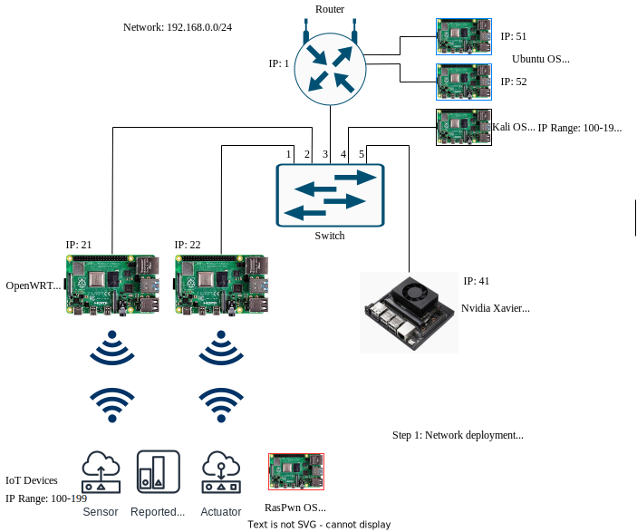

# DistriLearn
This repository is used to store scripts, tutorial, data, and any information about the distributed learning project.

This project is work for the paper presented at the IEEE UIC 2022 conference: Link coming soon.




# Models

All models used in this project are located in the ModelPack subdirectory. K-Neighbors is not included in this repo since they are all so large. 

Each model is organized based off of the dataset used to train it. 
 * CIC-IDS-2017: /ModelPack/clean_17_models/
 * CSE-CIC-IDS 2018: /ModelPack/clean_18_models/
 * 2018 + 2017: /ModelPack/17_18_models/

Each model is saved as a pickle (except NN which is saved as a \*.pth). Furthermore, we include the scaler used for each model when loaded on deployment, prefixed by the name "scaler", also saved as a pickle file. 

To load these models into the cluster, the following variables should be changed in server_dist.py:

```python
MODEL_TYPE = 0 

PATH_PREF = "./ModelPack/17_18_models/NN"

SCIKIT_MODEL_PATH = f"{PATH_PREF}/kn_17_18.pkl"
SCALER_PATH = f"{PATH_PREF}/scaler_nn_1718.pkl"
PYTORCH_MODEL_PATH = f"{PATH_PREF}/simple_nn_1718.pth"

```

* MODEL_TYPE is 0 for Sklearn models, and 1 for PyTorch models, based on the strategy pattern to load them.
* PATH_REF is the model prefix path as shown in the example.
* SCIKIT_MODEL_PATH is the suffix of the path for the model as shown in the example.
* SCALER_PATH is the suffix scaler name for the model as shown in the example.
* PYTORCH_MODEL_PATH is the same as SCIKIT_MODEL_PATH, except for PyTorch.


NOTE: The directory of the models, or wherever the models are, should be in the same directory as the server_dist script.


# Cluster Instructions

Dask enables plug-and-play functionality. Each of the nodes in the cluster must have the following packages installed:
```
numpy 
pytorch
pandas
sklearn
dask
joblib
scapy
nfstream
```
To launch the cluster, you must use the following command on the coordinating machine:
```
dask-scheduler
```

For each process or additional compute node, use the following command:
```
dask-worker tcp://<scheduler-ip>:<scheduler-port>
```

Finally, to launch the IDS launch the server_dist.py script on the coordinating machine (i.e., the scheduler).

# Extended Answers to Paper Results 

* <b>Our system beats snort, how is that? </b> Snort is a standard and state-of-the-art NIDS based on rule detection. When deployed, we configured Snort within a virtual machine environment using an internal network and its <it> community ruleset </it>. We mark the failures of Snort with two metrics: a.) Was the attack ever detected within the attacks duration? b.) Is is a delayed response? If the answer to 'a' is  "no" or the answer to 'b' is "yes", we mark it as a failure. In addition, if there is a point were we see false negatives (only one case/model in our experiments did this occur), it is also marked as a failed detection.

* <b> Following the above, is our system a replacement to Snort? </b> No. Snort is used as a baseline comparison to see how well the system not only performs in a real-time deployment, but if it is in fact comparable to a well-established system.

* <b> How is the system so fast/responsive </b> The machine learning models allow us to react quickly and respond in real-time traffic environments. The results shown are based on the non-determinism of flow generation. As stated in the paper, the flows vary on how or when they are generated based on incoming traffic; therefore, the response times are measured using the same criteria as for Snort. The difference is that, due to non-determinism, sometimes attacks are not detected within a reasonable time frame if at all. So, to compensate we take the overall or average best results from a series of runs on the system.

* <b> How are the resource utilizations and the system performance charts 'lightweight'?</b> The biggest thing is the plug-and-play and optimized nature of Dask. These results are averaged, but we note in the threats to validity that the utilization is not constant. It may rise due to operating system pressures we do not have direct control over (in fact, if we did, it may impact the performance more). This is improved upon in our extension to this work in the Unified Deployment branch.

* <b> How are false positives lowered? How is it measured? What about false negatives? </b> To measure false positive rates, we first take a look at how many malicious reports are made on the centralized system, and how many reports are made on the collaborative system. The rates are calculated based off of the flows relative to each individual session. So, if there are 100 false positives raised in the centralized version, that means that there were 100 flows detected as malicious incorrectly for the 30-minute session. If there are 100 false positives raised in the collaborative version, that means that there were 100 reports from groups of flows (can be many more than 100, depending on thresholds and report times). This indicates that there are less false positives per group of flows as opposed to individual reports. So, we compare these two metrics. False negatives are tricky to measure: flows are non-determinstic in real-time; more so, a flow that is malicious but detected as benign could be dependent on other benign traffic (like surfing the web, etc). However, we can say that one model (rf 1718, I believe) reports certain attacks made as benign which are false negatives.

# DISCLAIMER

This work and the accompanying NIDS is a proof-of-concept for research purposes only, and should be treated as such. 
